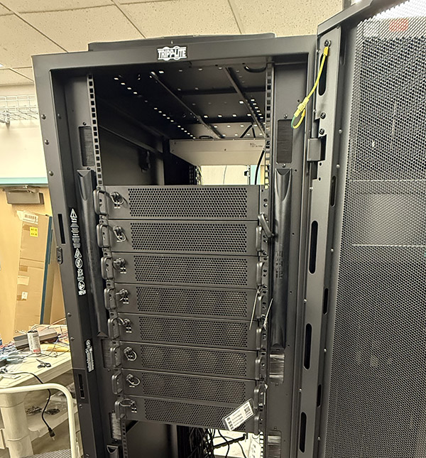

# The UIC Sandbox for the Sage Grande Testbed
The Sandbox provides users of the Sage Grande Testbed a place to start -- a set of nodes accessible via SSH specifically designed for exploration.  The Sandbox is a place to try new ideas, develop new software stacks, explore sensor interfaces, and for students who can visit the UIC EVL Lab, a testbed for connecting new sensors in a controlled laboratory environment. 

[The current development plan](./sandbox-plan.md)

